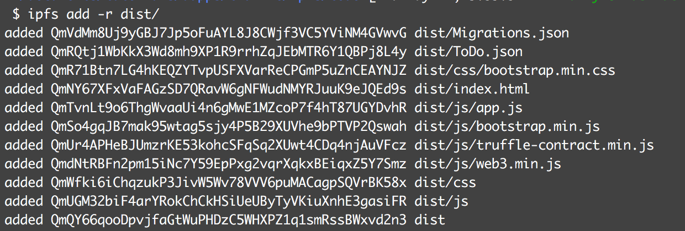
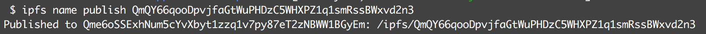

# Dapp, Truffle, IPFS: To Do 

- Links:
	- [Build a Fully Decentralized Application with IPFS - Ethereum Dapp Programming Tutorial, Dapp University, YouTube](https://www.youtube.com/watch?v=ADoRVVOSpI8) 
	- [How to Get Started with IPFS Decentralized Storage](https://mlgblockchain.com/intro-ipfs.html)
	- [How to Host Your IPFS Files Online Forever](https://medium.com/@merunasgrincalaitis/how-to-host-your-ipfs-files-online-forever-f0c56b9b5398)

- Tools:
	- Truffle: framework to create dapps on the ethereum network
	- Web3 JS: enables client side app to talk to the blockchain 
	- Metamask: enables browser to talk to the blockchain 
	- Ganache: local development blockchain 
	- IPFS: p2p protocol where each node stores a collection of hashed files 

- Sections:
	- Part 1: Backend
	- Part 2: Frontend
	- Part 3: IPFS 

## Part 3: IPFS
- Deploy all the client-side assets to ipfs--transfer/move all the client-side assets off the server and onto a distributed file system 
- IPFS
	- Install ipfs 
	- Initialize a new node: ipfs init 
	- Run the node: ipfs daemon
- Make a folder for the client-side assets and contract abstractions that will be served on ipfs: mkdir dist/
- Create a copy of all the files from src/ and sync it to dist/: rsync -r src/ dist/
- Create a copy of all the files from build/contracts/ and sync it to dist/: rsync -r build/contracts/ dist/
- Add all the files in dist/ to ipfs: ipfs add -r dist/

- Publish it: ipfs name publish 

- Access it: https://gateway.ipfs.io/ipfs/Qme6oSSExhNum5cYvXbyt1zzq1v7py87eT2zNBWW1BGyEm

